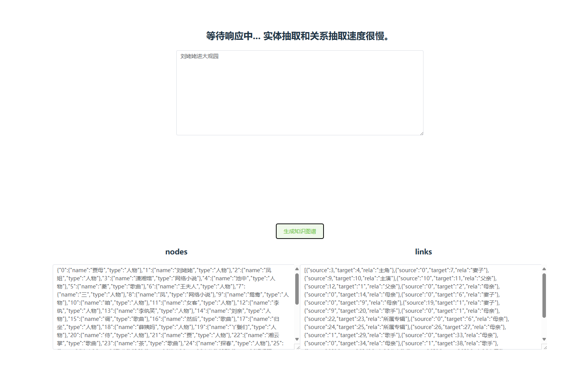
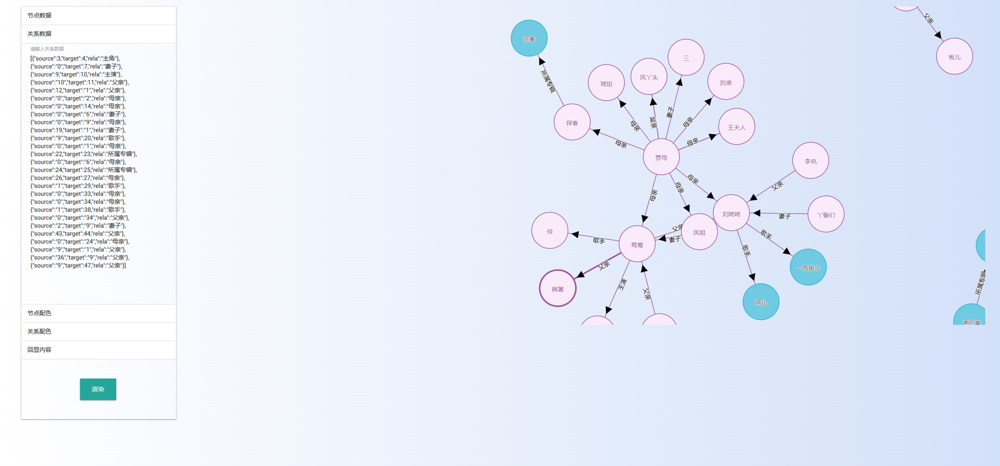

# simple knowledge graph generator

输入文本并生成知识图谱，包含前后端。nlp部分基于[deepke-cnschema](https://github.com/zjunlp/DeepKE/blob/main/example/triple/cnschema/README_CN.md)，前端展示基于[KGview](https://github.com/molamolaxxx/KGView)。

前端部分[graphxr](https://www.kineviz.com/graphxr)也是不错的选择，但是要注册就没选。

## 图片展示
（“刘姥姥进大观园”是预置的输入，这一章节内容对应的triples会被直接返回无需再次生成，减少等待时间）




## 项目结构

```markdown
.
├── `api` 后端部分
│   ├── `.devcontainer` 开发容器配置，用于隔离开发环境
│   ├── `cnschema` deepke-cnschema项目，稍做了一些修改。
│   ├── `docekr` docker相关文件，方便部署到开发环境
│   ├── `models` deepke-cnschema用到的模型放在这里面，ner和re都采用robert。
│   ├── `static` 网页放在这里。
│   ├── `api.py` 用于暴露API
│   └── `KnowledgeGraph.py` 对cnschema的抽象，方便api调用。
└── `vue` 前端部分，没啥好说的。
```

## 使用和开发说明
### 部署和测试运行

后端
1. 运行环境用的是[deepke](https://github.com/zjunlp/DeepKE)里的[dockerfile](https://github.com/zjunlp/DeepKE/tree/main/docker)生成的容器，也可以用dockerhub的[zjunlp/deepke](https://hub.docker.com/r/zjunlp/deepke)，或者自己用对应版本的pytorch容器都可以。
2. pip install的时候安装我写的requirements.txt，不用安装cnschema里的requirements。
3. [下载deepke-cnschema模型](https://github.com/zjunlp/DeepKE/blob/main/example/triple/cnschema/README_CN.md#%E4%B8%AD%E6%96%87%E6%A8%A1%E5%9E%8B%E4%B8%8B%E8%BD%BD)，需要下载一个ner模型和一个re模型，我选的是`DeepKE(NER), RoBERTa-wwm-ext, Chinese`和`DeepKE(RE), RoBERTa-wwm-ext, Chinese`，运行这个项目需要把这两个模型下载下来放到`项目根目录/api/models/`下，一个是目录，一个是pth文件。
   1. 模型位置的配置文件在`项目根目录/api/cnschema/conf/predict.yaml`，你需要修改这个配置文件来告诉cnschema模型在哪里。

然后是前端
1. 在vue目录下创建.env文件，编辑文件`VITE_BASE_URL=http://127.0.0.1:8000`，具体端口自己和docker compose里写的对照一下
2. 然后在vue目录执行`npm install && npm run build`，构建好了之后把`vue/dist`目录下的内容复制粘贴到`api/static`下，此时的static目录结构：
   1. static
      1. assets
      2. show
      3. vite.svg
      4. index.html

最后在容器内的/workspace执行`python api.py`即可启动。

测试：
1. 启动之后在浏览器打开127.0.0.1:8000——同样的具体端口看compose里怎么映射的——就会打开vue写的获取triples的页面，输入内容，然后等待一段时间会获取到nodes和links，复制这两段文本

2. 再打开127.0.0.1:8000/show，在左侧的节点数据中粘贴nodes值，关系数据中粘贴links值，然后点左下角渲染按钮，即可生成示例所示的网状图。

3. 输入内容的时候可以写`刘姥姥进大观园`，如果后台检测到这个输入会直接返回之前生成好的刘姥姥进大观园章节的知识图谱，不需要再生成一遍，因为实在太耗时间了。不是这个输入的都会重新跑一遍实体识别和关系抽取，没写缓存。

## todo
 - [ ] 更省心的部署
 - [ ] 更现代的前端
 - [ ] 更智能的关系抽取
 - [ ] 知识图谱缓存